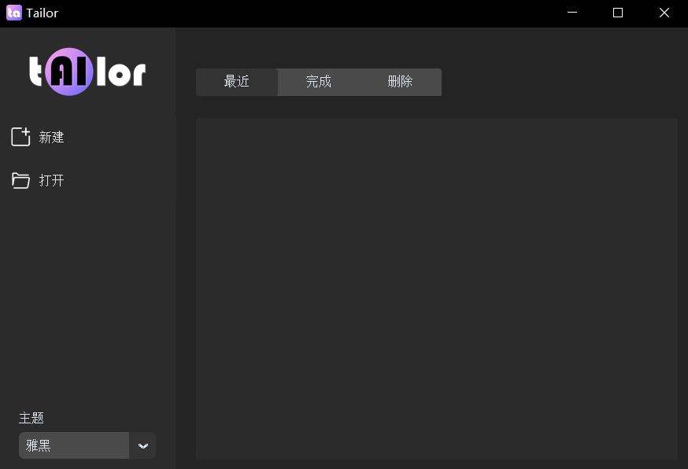
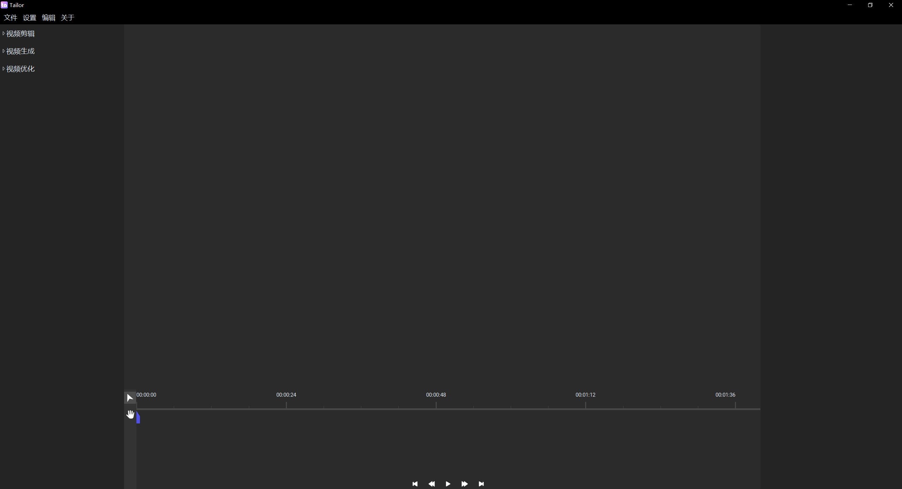

<div align="center">
  

  <h1>UCut — AI-Powered Video Editor</h1>

  <p>
  🎬 Video Cut · 🎨 Video Generate · ⚡ Video Optimize · 🌐 Online Download
  </p>

<p>
<strong>Click. AI does the rest.</strong>
<br/>
🌏 简体中文 · 繁體中文 · English
</p>

  <p>
  <a href="#features">Features</a> ·
  <a href="#installation">Installation</a> ·
  <a href="#changelog">Changelog</a>
  </p>

<div>
  <strong>
  <samp>

[简体中文](README.md) · [English](README.en.md)

  </samp>
  </strong>
  </div>
</div>

---

## ✨ Highlights

| Feature | Description |
|---------|-------------|
| 🧠 **AI Face & Voice Cut** | Auto-detect faces and speech, precision cropping |
| 🎤 **AI Broadcast Gen** | One portrait + text = talking video |
| 🎞️ **Erase Subtitles** | Remove subtitles with **5× speed boost** ✅ |
| 🖼️ **Background Replace** | Separate foreground, swap any background |
| 🎨 **AI Colorization** | B&W to color in one click |
| 🌐 **Online Download** | **Bilibili / Douyin / YouTube / Twitter** + 1000+ sites |
| 🚀 **Open Video Directly** | Skip projects, edit any video file instantly |
| 🔄 **Smoothness & Resolution** | De-jitter, upscale, enhance quality |
| 🎯 **Target Removal** | Track and erase unwanted objects or people |
| 🌏 **Multilingual UI** | Built-in **简体中文 · 繁體中文 · English**, switch at any time |

---

<a id="introductions"></a>
## 🎯 Introduction

**UCut** is an AI-powered video processing toolkit that combines **video cutting, video generation, video optimization**, and now **online video downloading** into one seamless workflow — from sourcing footage to final export.

No professional editing skills required. Just click, and let AI handle the heavy lifting.

### Interface

| Home | Workspace |
|:---:|:---:|
|  |  |

---

<a id="features"></a>
## 🚀 Features

UCut supports **13 video processing methods** covering the entire video production pipeline.

### 🎬 Video Cut

<details>
<summary><strong>Face Cut</strong> — AI face detection & auto-crop</summary>
<p>Automatically captures every face in your video. Select who to focus on, and UCut crops the footage around them — like magic.</p>
</details>

<details>
<summary><strong>Voice Cut</strong> — Speech recognition & precision trimming</summary>
<p>Transcribes video speech and lets you select segments to keep. Perfect for removing dead air or keeping only the best takes.</p>
</details>

### 🎨 Video Generate

<details>
<summary><strong>Broadcast Gen</strong> — Image + Text = Talking Video</summary>
<p>Upload a face image, pick a voice tone, type your script — UCut generates a lip-synced talking video instantly.</p>
</details>

<details>
<summary><strong>Captions</strong> — Auto subtitle generation</summary>
<p>Transcribes audio to text with multi-font, multi-color styling. Subtitles sync perfectly with your video.</p>
</details>

<details>
<summary><strong>Colorize</strong> — One-click B&W video colorization</summary>
<p>Breathe new life into vintage footage. One click turns black-and-white into vibrant color.</p>
</details>

<details>
<summary><strong>Audio Gen</strong> — Image & text to video</summary>
<p>Combine a static image with TTS-generated speech to create a complete video. Infinite creative possibilities.</p>
</details>

<details>
<summary><strong>Language Swap</strong> — Video dubbing in any language</summary>
<p>Convert speech in your video to any language. Break language barriers and reach global audiences.</p>
</details>

### ⚡ Video Optimize

<details>
<summary><strong>Background Replace</strong> — Foreground separation & swap</summary>
<p>Intelligently separates foreground subjects from background. Replace with any image or video backdrop.</p>
</details>

<details>
<summary><strong>Frame Interpolation</strong> — Buttery smooth video</summary>
<p>Advanced frame interpolation eliminates stutter and judder. Makes choppy footage flow like silk.</p>
</details>

<details>
<summary><strong>Super Resolution</strong> — AI upscaling</summary>
<p>Boost low-resolution video quality. Say goodbye to pixelation and hello to crisp, clear detail.</p>
</details>

<details>
<summary><strong>Erase Subtitles</strong> ⚡ — AI subtitle removal</summary>
<table>
<tr><td>✅ <strong>5× faster</strong> processing</td><td>✅ <strong>Cancel</strong> anytime</td><td>✅ Real-time progress</td></tr>
</table>
<p>Removes hardcoded subtitles from videos. Great for repurposing movie clips or cleaning up educational content. <strong>New:</strong> stride-based processing (stride=5) delivers 5× speedup; cancel button lets you stop mid-process.</p>
<p></p>
</details>

<details>
<summary><strong>Target Removal</strong> — Smart object/person erasure</summary>
<p>Click on any unwanted object, person, or blemish — UCut tracks and removes it automatically.</p>
<p></p>
</details>

<details>
<summary><strong>Local Processing</strong> — Selective focus & color effects</summary>
<p>Apply visual focus or grayscale effects to specific subjects. Highlight your protagonist or create artistic moods.</p>
</details>

### 🌐 Online Download (New)

<details open>
<summary><strong>Video Download</strong> — Supports <strong>1000+</strong> platforms</summary>

| Platform | Support |
|----------|---------|
| 🅱️ **Bilibili / B站** | ✅ Full support (360p/480p free, 720p+/1080p with premium cookies) |
| 🎵 **Douyin / TikTok China** | ✅ Supported (browser cookies required) |
| ▶️ **YouTube** | ✅ Supported |
| 🐦 **Twitter / X** | ✅ Supported |
| 📸 **Instagram** | ✅ Supported |
| 🌍 **1000+ more sites** | ✅ Powered by yt-dlp engine |

**Multiple download methods:**
- 📋 **Paste URL** — enter any video link directly in UCut
- 🍪 **Auto Cookie Extraction** — automatically grabs login cookies from Chrome/Edge
- 📁 **Manual Cookie Import** — paste or upload cookie files
- ⚡ **Direct Open** — auto-open downloaded video for editing, no project creation needed
</details>

---

<a id="installation"></a>
## 📦 Installation

UCut offers **User Mode** (recommended) and **Developer Mode**.

### User Mode
[Download UCut from GitHub](https://github.com/FutureUniant/Tailor/releases) and double-click to install.  
Currently Windows-only.

### Developer Mode

#### Prerequisites
- Python 3.10 ~ 3.14

#### Quick Start

```bash
# 1. Clone
git clone https://github.com/FutureUniant/Tailor.git
cd UCut

# 2. (Optional) GPU acceleration — ensure CUDA + cuDNN

# 3. Install core dependencies
pip install -r requirements.txt

# Note for Python 3.14: some packages need manual version adjustments
#    - Downgrade numpy: pip install "numpy<2"
#    - g2p_en patch: see patches/ directory
#    - pyaudio stub used automatically if missing

# 4. Install FFmpeg & ImageMagick
#    Download and extract to UCut/extensions/:
#    - FFmpeg: https://www.gyan.dev/ffmpeg/builds/packages/ffmpeg-6.1.1-essentials_build.7z
#    - ImageMagick: https://imagemagick.org/archive/binaries/ImageMagick-7.1.1-29-portable-Q16-x64.zip

# 5. Launch
python main.py
```

> 💡 If double-clicking main.py flashes a console window, use `pythonw main.py` instead or double-click `start.bat`.

---

<a id="getting-started"></a>
## 🎯 Getting Started

### Way 1: Use a Project (Recommended)
1. Click **New** on the home screen, name your project
2. Import a video via **File → Import** or **Online Download**
3. Select a processing method and follow the prompts

### Way 2: Open Video Directly (✨ New)
1. Click **Open** on home screen, select a video file (mp4/avi/mov/mkv/webm/flv etc.)
2. Edits immediately — no project needed

### Way 3: Download & Auto-Edit
1. Click **Online Download**, paste a video URL
2. Check **Direct Open After Download**
3. Video opens for editing as soon as it finishes

---

<a id="changelog"></a>
## 📝 Changelog

<details open>
<summary><strong>2025/2026 · Major Updates</strong></summary>

| Date | Change |
|------|--------|
| 🆕 **New** | 🌐 **Online Video Download** — Bilibili/Douyin/YouTube/Twitter + 1000+ sites, auto cookie extraction |
| 🆕 **New** | 📂 **Open Video Directly** — edit videos without creating .tailor projects |
| 🆕 **New** | 📥 **Downloaded Videos** section on home screen — recent downloads at your fingertips |
| ⚡ **Optimized** | 🔥 **Erase Subtitles 5× faster** — stride-based processing (stride=5), cancel anytime |
| 🔧 **Compatibility** | 🐍 **Python 3.14 support** — latest runtime compatibility |
</details>

<details>
<summary><strong>2024 · Historical</strong></summary>

- **2024/08/07:** Erase subtitles feature; progress bars; startup UI prompt; mask Z-order fix
- **2024/07/23:** Voice-driven broadcast gen; model integrity checks; UI and multi-process bug fixes
- **2024/05/31:** 🎉 Initial release!
</details>

---

<a id="business"></a>
## 🤝 Business Inquiries
`mongodb1994@qq.com`

<a id="support"></a>
## ☕ Support the Project
Support ongoing development and maintenance:

| WeChat | Alipay |
|--------|--------|
|  |  |

<a id="issue"></a>
## 📬 Issues & Feedback
GitHub Issues · `mongodb1994@qq.com`

<a id="special-thanks"></a>
## 🙏 Special Thanks
- [whisper](https://github.com/openai/whisper) · [DDColor](https://github.com/piddnad/DDColor) · [EmotiVoice](https://github.com/netease-youdao/EmotiVoice)
- [facenet-pytorch](https://github.com/timesler/facenet-pytorch) · [MODNet](https://github.com/ZHKKKe/MODNet) · [SadTalker](https://github.com/OpenTalker/SadTalker)
- [cv_raft_video-frame-interpolation](https://modelscope.cn/models/iic/cv_raft_video-frame-interpolation/summary)
- [cv_rrdb_image-super-resolution_x2](https://modelscope.cn/models/bubbliiiing/cv_rrdb_image-super-resolution_x2/summary)

<a id="license"></a>
## 📄 License
[Apache-2.0 license](LICENSE)
